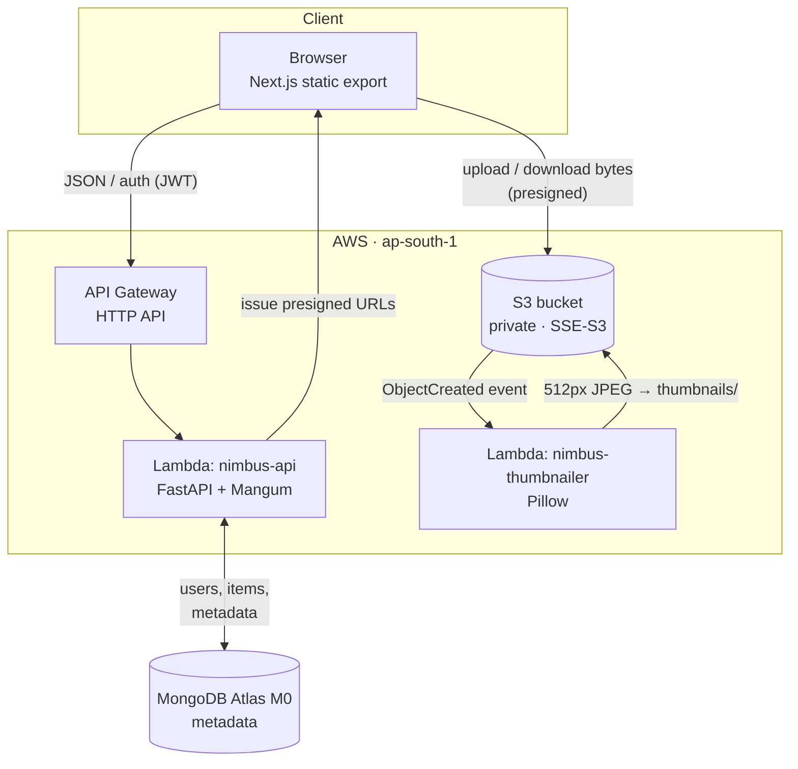

# ☁️ Nimbus

**Own your cloud. Own your data.**

Nimbus is a self-hosted, open-source alternative to Google Drive + Google
Photos. It is a privacy-focused place to store, browse, and back up your
files and photos — built on a serverless, cloud-native architecture that
runs comfortably within free-tier and pay-per-use pricing.

> **Status:** the backend is **live and deployed** on AWS. This is a working
> file manager backed by real uploads and downloads — not a UI mockup.

---

## ✨ Highlights

- **Drive-style file manager** — folders, upload, download, preview, rename,
  move, trash/restore, and permanent delete.
- **Photos-style library** — a date-oriented photo grid with a lightbox.
- **Automatic thumbnails** — every uploaded image is thumbnailed server-side,
  end to end, without blocking the upload.
- **Direct-to-storage transfers** — the browser uploads and downloads file
  bytes straight to object storage via presigned URLs; the API never proxies
  file data.
- **Full-text search, recent files, and storage usage** reporting.
- **Multi-user auth** — per-user isolated storage with JWT + bcrypt.
- **Resumable Google Takeout migration** for bulk-importing existing data.

---

## 🏗️ Architecture

Nimbus is fully serverless. The API is a single AWS Lambda (FastAPI behind
[Mangum](https://github.com/jordaneremieff/mangum)) fronted by an API Gateway
HTTP API. Because Lambda is stateless, both the database (MongoDB Atlas) and
file storage (S3) live outside it. Crucially, **file bytes never flow through
the API** — the browser talks to S3 directly using short-lived presigned URLs,
which keeps compute cost near zero regardless of file size.



**Request flow**

1. The browser authenticates against API Gateway and receives a JWT.
2. To upload, it asks the API for a presigned `PUT` URL, then sends the bytes
   **directly to S3** — the Lambda only records metadata in MongoDB.
3. An S3 `ObjectCreated` event triggers the thumbnailer Lambda, which writes a
   512px JPEG under `thumbnails/`.
4. To view or download, the browser requests a presigned `GET` URL and again
   fetches bytes straight from S3.

---

## 🧰 Tech Stack

| Layer | Technology |
|---|---|
| **Frontend** | Next.js 16 (React 19), Tailwind CSS v4, Lucide icons — static export (`output: "export"`), client-rendered |
| **Backend** | FastAPI (Python 3.13) + Mangum, running on AWS Lambda |
| **API edge** | AWS API Gateway (HTTP API) |
| **Database** | MongoDB Atlas M0 (free tier), via Motor (async) |
| **File storage** | AWS S3 — private bucket, SSE-S3, presigned direct upload/download |
| **Thumbnails** | S3 event → Lambda (Pillow) |
| **Auth** | JWT (HS256, 24h) + bcrypt |
| **Infrastructure** | CloudFormation (`infra/nimbus-backend.yaml`) |
| **CI/CD** | GitHub Actions — CI on every PR; deploy on merge to `main` via GitHub OIDC (no stored AWS keys) |

---

## 📡 API Reference

Base path: `/api/v1`. All `/files` routes require a `Bearer` JWT.

**Auth** — `/auth`

| Method | Path | Description |
|---|---|---|
| `POST` | `/register` | Create an account |
| `POST` | `/login` | Obtain a JWT |
| `GET` | `/me` | Current user |
| `POST` | `/forgot-password` | Request password reset |

**Files** — `/files`

| Method | Path | Description |
|---|---|---|
| `GET` | `` | Paginated listing |
| `GET` | `/photos` | Photo library (date-grid) |
| `GET` | `/search` | Search items |
| `GET` | `/recent` | Recently touched items |
| `GET` | `/trash` | Trashed items |
| `GET` | `/usage`, `/usage/detail` | Storage usage |
| `POST` | `/folders` | Create a folder |
| `POST` | `/upload-url` | Presigned upload URL |
| `POST` | `/{id}/complete` | Finalize an upload |
| `GET` | `/{id}/download-url` | Presigned download URL |
| `GET` | `/{id}/preview-url` | Presigned preview URL |
| `GET` | `/{id}/thumbnail-url`, `POST /thumbnail-urls` | Thumbnail URL(s) |
| `POST` | `/move`, `/trash`, `/restore`, `/delete-permanently` | Bulk operations |
| `PATCH` | `/{id}` | Rename |
| `DELETE` | `/{id}` | Soft-delete (trash) |

**Health** — `GET /health`

> **Note:** deletion is soft — `DELETE` moves items to trash; only
> `/delete-permanently` (and the scheduled purge) remove objects from S3.

---

## 📂 Repository Layout

```
Nimbus/
├── backend/            # FastAPI app (Lambda handler, endpoints, services, repos)
│   ├── app/
│   │   ├── api/        # routers + endpoints (auth, files, health)
│   │   ├── services/   # auth & file business logic
│   │   ├── repositories/  # MongoDB data access
│   │   ├── storage/    # S3 abstraction + key layout
│   │   ├── jobs/       # scheduled purge
│   │   └── lambda_handler.py
│   └── tests/          # backend test suite
├── frontend/           # Next.js 16 app (landing, auth, dashboard)
├── thumbnailer/        # S3-triggered thumbnail Lambda (Pillow)
├── infra/              # CloudFormation template (nimbus-backend.yaml)
├── scripts/            # Lambda packaging, thumbnail backfill, Takeout migration
├── docs/               # architecture notes
├── requirements.md     # goals, cost model, and design rationale
└── template.yaml       # for `sam build` only (not used for deploy)
```

---

## 🚀 Getting Started

### Prerequisites

- Python 3.13+
- Node.js 20+
- Docker & Docker Compose (for local MongoDB)
- An AWS account (for the deployed backend + storage)

### 1. Configure environment

```bash
cp .env.example .env
cp frontend/.env.example frontend/.env.local
# fill in values — .env is gitignored, never commit real secrets
# generate a JWT secret with: openssl rand -hex 32
```

### 2. Run the backend locally

The bundled `docker-compose.yml` starts the FastAPI backend plus a local
MongoDB:

```bash
docker compose up -d --build
# API → http://localhost:8000
```

### 3. Run the frontend

```bash
cd frontend
npm install
npm run dev
# UI → http://localhost:3000
```

Set `NEXT_PUBLIC_API_BASE_URL` in `frontend/.env.local` to point at your API
(local or deployed).

### 4. Deploy to AWS

Infrastructure is plain CloudFormation. Package and deploy the Lambda:

```bash
# build a slim Lambda zip (boto3/botocore are provided by the runtime)
scripts/package_lambda.sh

# deploy / update the stack
aws cloudformation deploy \
  --template-file infra/nimbus-backend.yaml \
  --stack-name nimbus-backend \
  --region ap-south-1 \
  --capabilities CAPABILITY_NAMED_IAM
```

Read the live API URL from the stack rather than hardcoding it:

```bash
aws cloudformation describe-stacks --stack-name nimbus-backend \
  --region ap-south-1 \
  --query 'Stacks[0].Outputs[?OutputKey==`ApiUrl`].OutputValue' --output text
```

On merge to `main`, GitHub Actions deploys automatically via GitHub OIDC — no
AWS credentials are stored in the repo.

---

## 📦 Migrating from Google Takeout

`scripts/migrate_takeout.py` bulk-imports an existing Google Takeout export.
It is **resumable** and **sidecar-aware** (it reads Takeout's `.json` metadata
alongside each media file), so a large migration can be interrupted and
restarted safely.

---

## 🗺️ Roadmap

- [ ] Deploy the frontend (Next.js static export) to a public origin
- [ ] Scheduled trash purge + stale-upload cleanup to reclaim storage
- [ ] Persistent sessions (refresh tokens) so a reload keeps you signed in
- [ ] Password-reset email delivery (currently a stub)
- [ ] AI-powered semantic search & tagging
- [ ] Cross-device sync and PWA support

---

## 🧪 Development

```bash
# backend tests
cd backend && pytest

# frontend checks
cd frontend && npm run lint && npm run build
```

---

## 📄 License

See [LICENSE](LICENSE).

---

*Own your cloud. Own your data.*
