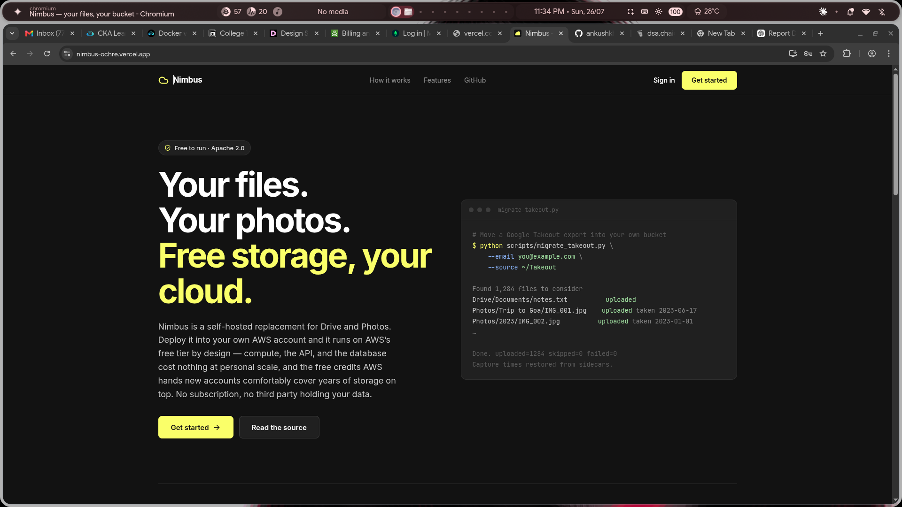
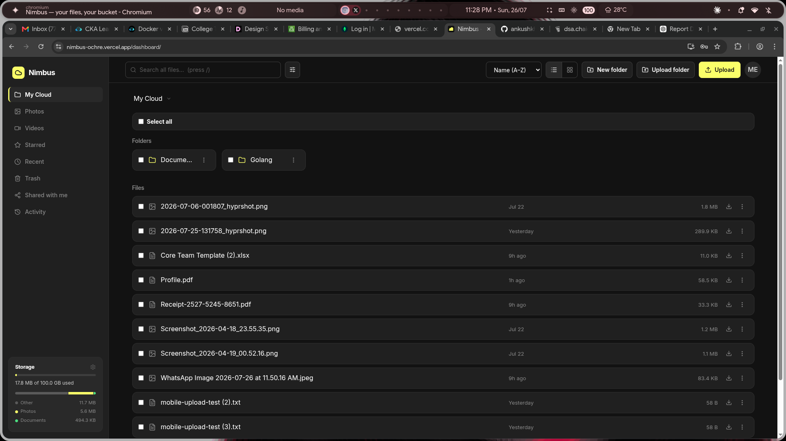
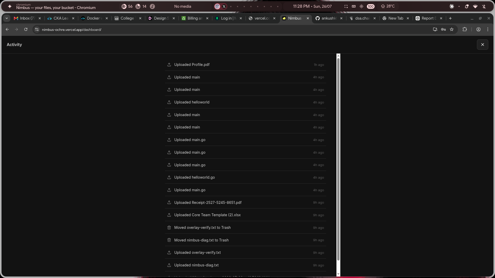
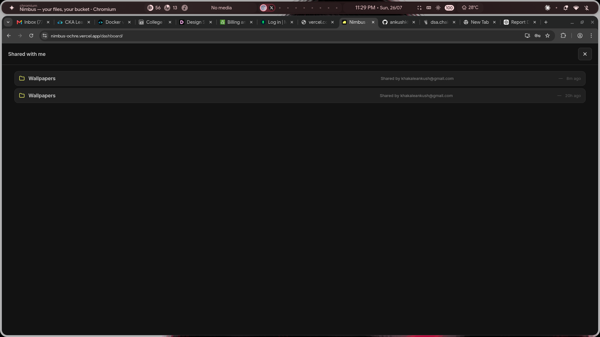
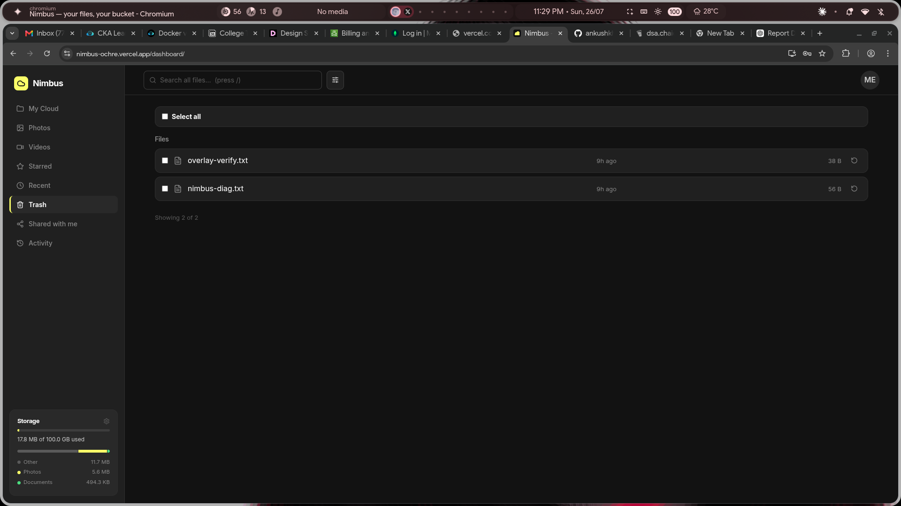
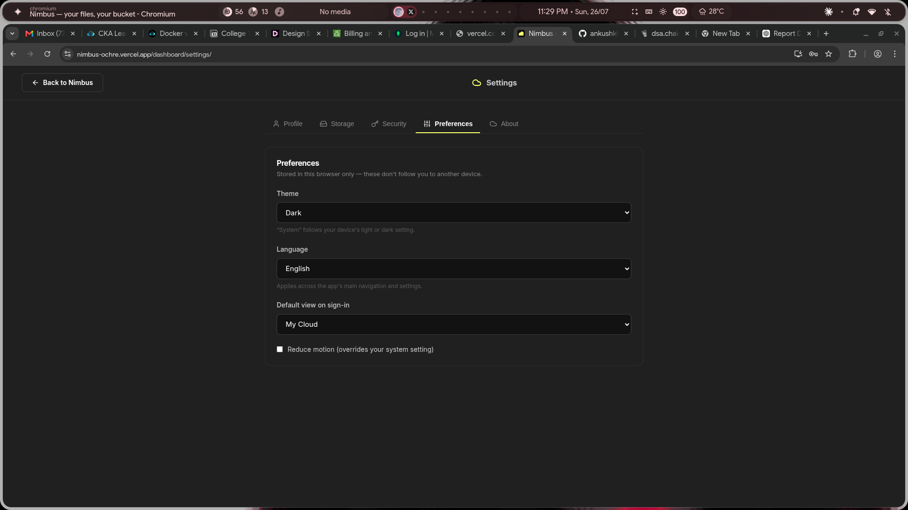
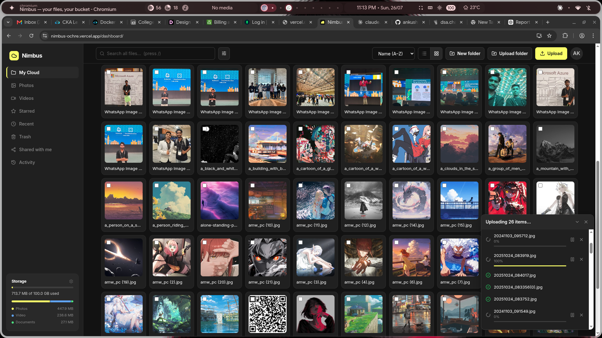
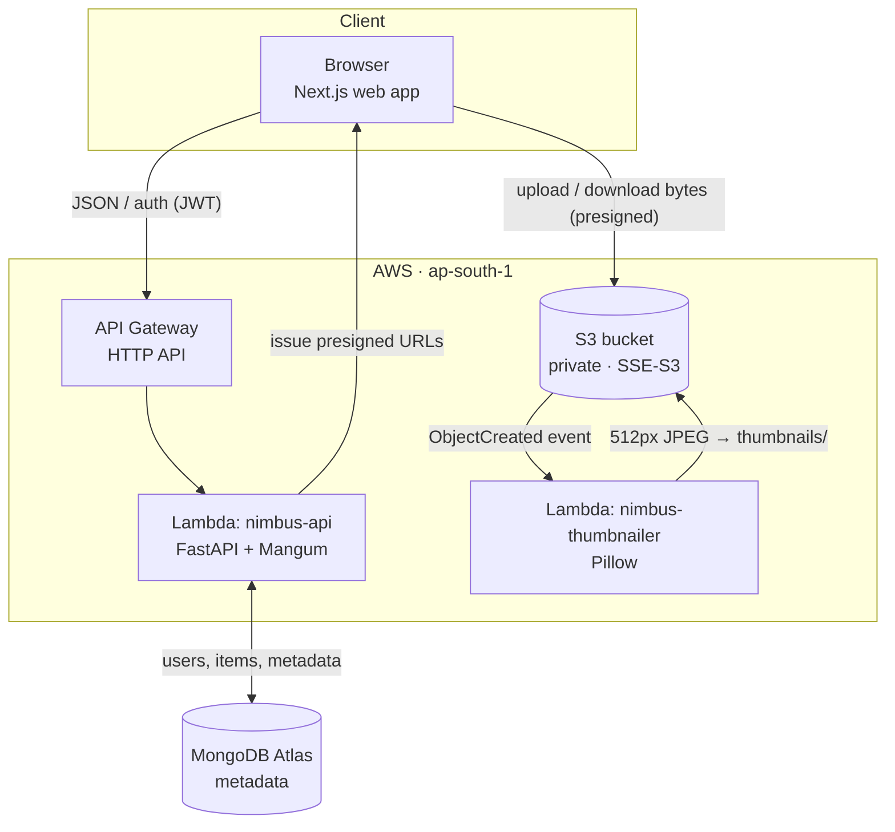

<div align="center">

# ☁️ Nimbus

### Free cloud storage for your files & photos — no subscription, no catch.

A clean, fast, open-source alternative to Google Drive + Google Photos.
**Just create an account and start uploading.**

[](https://nimbus-ochre.vercel.app)
&nbsp;
[](https://github.com/ankushkhakale/Nimbus)
&nbsp;


<br/>



</div>

---

## What is Nimbus?

Nimbus is a hosted, **free-to-use** cloud drive: a place to keep your
documents, photos, and videos, browse them in a polished web app, and get
them back on any device. It looks and feels like Drive and Photos — folders,
a photo timeline, sharing, search — without the subscription and without a
big company mining your library.

It's also **fully open source**. The whole thing runs on a serverless,
pay-nothing-while-idle architecture, so anyone can read the code, learn from
it, or contribute. But you don't need to know any of that to use it —
**just [sign up](https://nimbus-ochre.vercel.app) and upload.**

<div align="center">

<sub><i>Your photo library — thumbnailed automatically, browsable in a fast grid, with uploads running in the background.</i></sub>
</div>

---

## ✨ Features

**Files & folders**
- Upload files or whole folders, download, preview, rename, move, and organize
- Soft **Trash** with restore — nothing is gone until you say so
- **Star** important items and give folders **colors**
- List and grid views, sortable, with infinite scroll

**Photos & media**
- A **Photos** timeline with a full-screen lightbox (zoom, slideshow, cast to TV)
- In-browser **photo editing** (crop, rotate, brightness, contrast)
- **Automatic thumbnails** for every image, generated server-side
- **Duplicate detection** and photo stacks; **map view** from photo GPS data

**Uploads that don't give up**
- Big files upload in resilient **multipart** chunks
- A **Google-Drive-style upload tray** with per-file pause / resume / cancel
- Drops on flaky networks **auto-pause and resume** when you're back online
- **Resume** interrupted uploads, and bulk-import a **Google Takeout** export

**Sharing & collaboration**
- **Share links** — public, expiring, or to named recipients — for files and folders
- A **Shared with me** view
- **File versioning** with bounded history

**Find & track**
- Full **search** with filters and saved searches; **Recent** view
- An **Activity** feed and **login-activity** log
- **Storage usage** breakdown by type

**Your account, your way**
- Email/password or **Google / GitHub** sign-in
- **Session management** — see and revoke signed-in devices
- **Light / dark theme**, **English / हिन्दी**, and accessibility-minded UI

> Every feature listed above is **built and running today** — not a roadmap.

---

## 🖼️ A look around

| | |
|:--:|:--:|
| <br/><sub><b>My Cloud</b> — files, folders, and storage at a glance</sub> | <br/><sub><b>Activity</b> — a timeline of everything you've done</sub> |
| <br/><sub><b>Shared with me</b> — folders others sent your way</sub> | <br/><sub><b>Trash</b> — soft-deleted, restorable until purged</sub> |
| <br/><sub><b>Settings</b> — theme, language, and preferences</sub> | <br/><sub><b>Trash</b> - resumable uploadation without any issues |

---

## 🧭 How you use it

1. **Create an account** at [nimbus-ochre.vercel.app](https://nimbus-ochre.vercel.app) — email/password, or Google / GitHub.
2. **Upload** files, folders, or drag-and-drop right onto the page. Big files and slow connections are handled for you.
3. **Organize** with folders, stars, and colors; browse photos in the timeline.
4. **Share** a link when you need to — public, expiring, or to specific people.
5. **Find** anything with search, Recent, and the Activity feed.

That's it. There's nothing to install and nothing to configure.

---

## 🏗️ Architecture (for the curious)

Nimbus is **fully serverless** and costs nothing while idle. The API is a
single AWS Lambda (FastAPI behind [Mangum](https://github.com/jordaneremieff/mangum))
fronted by an API Gateway HTTP API. Because Lambda is stateless, the database
(MongoDB Atlas) and file storage (S3) live outside it. Crucially, **file bytes
never flow through the API** — the browser uploads and downloads straight to S3
using short-lived presigned URLs, so compute cost stays near zero no matter how
large the files are.



**What happens when you upload a photo**

1. The browser authenticates and holds a short-lived JWT (with a refresh cookie so a reload keeps you signed in).
2. It asks the API for a presigned `PUT` URL and sends the bytes **directly to S3** — the Lambda only records metadata.
3. An S3 `ObjectCreated` event triggers the thumbnailer Lambda, which writes a 512px JPEG under `thumbnails/`.
4. To view or download, the browser requests a presigned `GET` URL and fetches the bytes straight from S3.

---

## 🧰 Tech stack

| Layer | Technology |
|---|---|
| **Frontend** | Next.js 16 (React 19), static export, client-rendered, Lucide icons |
| **Backend** | FastAPI (Python 3.13) + Mangum on AWS Lambda |
| **API edge** | AWS API Gateway (HTTP API) |
| **Database** | MongoDB Atlas via Motor (async) |
| **File storage** | AWS S3 — private bucket, SSE-S3, presigned direct upload/download |
| **Thumbnails** | S3 event → Lambda (Pillow) |
| **Auth** | JWT (HS256) + bcrypt, httpOnly refresh cookie, Google/GitHub OAuth |
| **Infrastructure** | CloudFormation (`infra/nimbus-backend.yaml`) |
| **CI/CD** | GitHub Actions — CI on every PR; deploy on merge via GitHub OIDC (no stored AWS keys) |

---

## 📡 API reference

Base path: `/api/v1`. All `/files` routes require a `Bearer` JWT.

**Auth** — `/auth`: `register`, `login`, `refresh`, `logout`, `me`, OAuth
callbacks, session management, login-activity.

**Files** — `/files`: paginated listing, `photos`, `search`, `recent`,
`trash`, `usage`; `folders`, `upload-url` (+ multipart), `{id}/complete`,
`{id}/download-url` / `preview-url` / `thumbnail-url`; `move` / `trash` /
`restore` / `delete-permanently`; rename (`PATCH /{id}`); sharing, versions,
and activity.

**Health** — `GET /health`.

> Deletion is soft: `DELETE` moves items to Trash; only `/delete-permanently`
> (and the scheduled purge) remove objects from storage.

---

## 📂 Repository layout

```
Nimbus/
├── backend/        # FastAPI app — endpoints, services, repositories, storage, jobs
├── frontend/       # Next.js web app — landing, auth, dashboard
├── thumbnailer/    # S3-triggered thumbnail Lambda (Pillow)
├── infra/          # CloudFormation template
├── scripts/        # Lambda packaging, thumbnail backfill, Takeout migration
├── docs/           # architecture notes + screenshots
└── requirements.md # goals, cost model, and design rationale
```

---

## 🤝 Contributing

Nimbus is open source and contributions are welcome. The best way to start is
to **read the codebase** — it's organized by layer (see above) and every
feature shipped as its own reviewed pull request, so the git history is a
readable tour of how things were built.

- 🐛 Found a bug or have an idea? [Open an issue](https://github.com/ankushkhakale/Nimbus/issues).
- 🔧 Want to build something? Fork, branch, and open a PR — CI runs backend tests plus frontend type-checks and a production build on every PR.
- ⭐ Like the project? **[Star it on GitHub](https://github.com/ankushkhakale/Nimbus)** — it genuinely helps.

---

## 📄 License

Licensed under the [Apache License 2.0](LICENSE).
---
<div align="center">
<br/>
<sub>Made with ❤️ by <b>Ankush Khakale</b> · Your files, your cloud.</sub>
</div>
